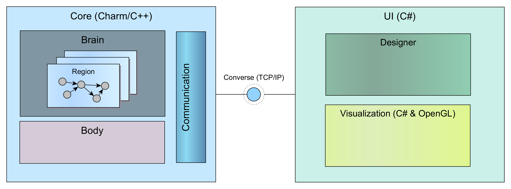
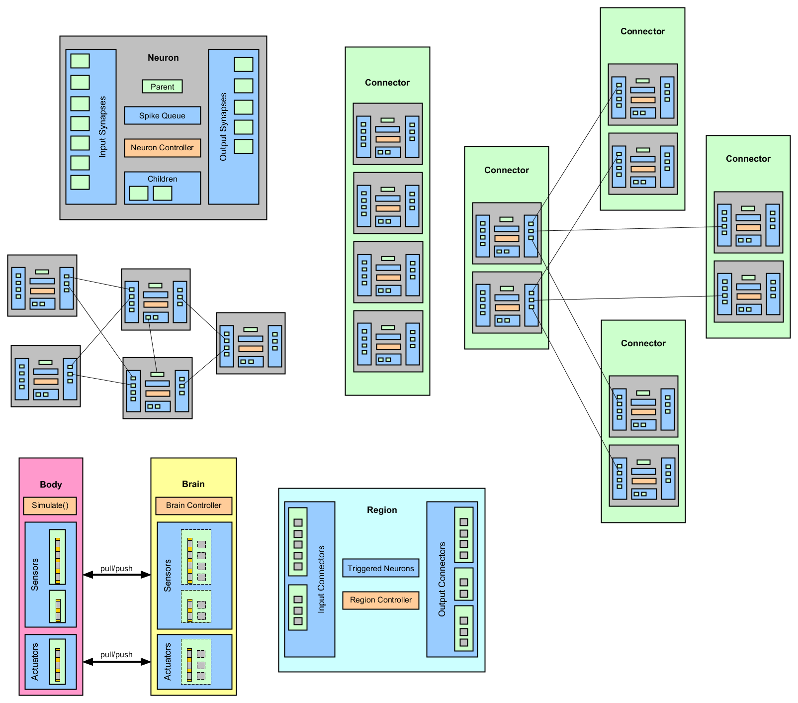
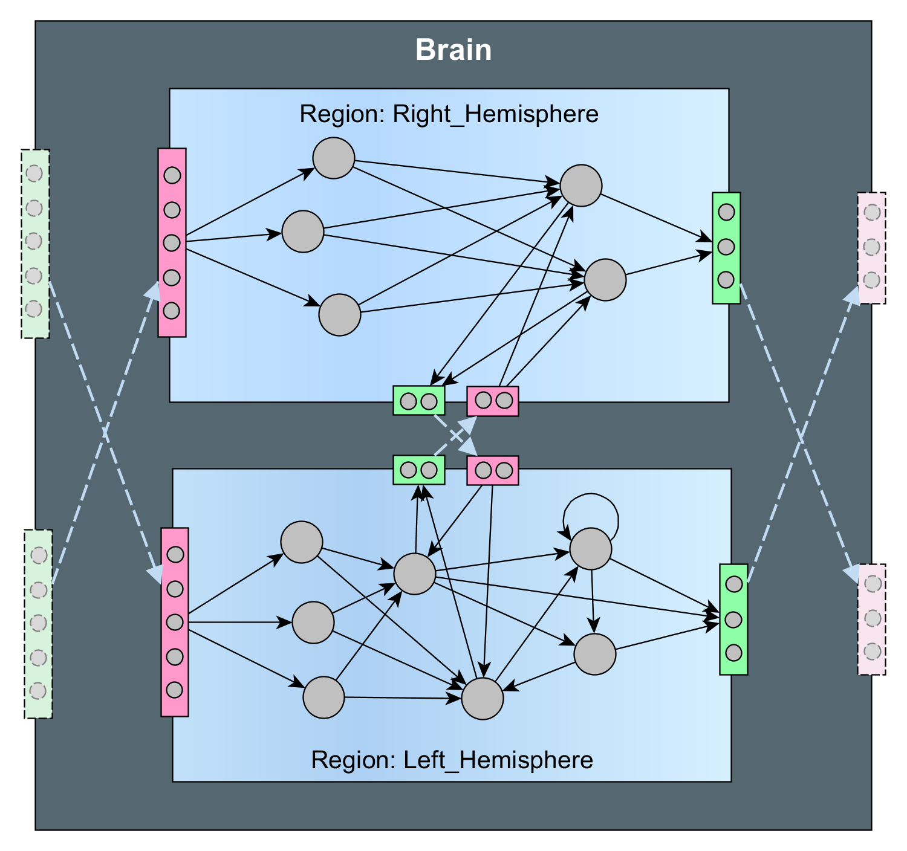
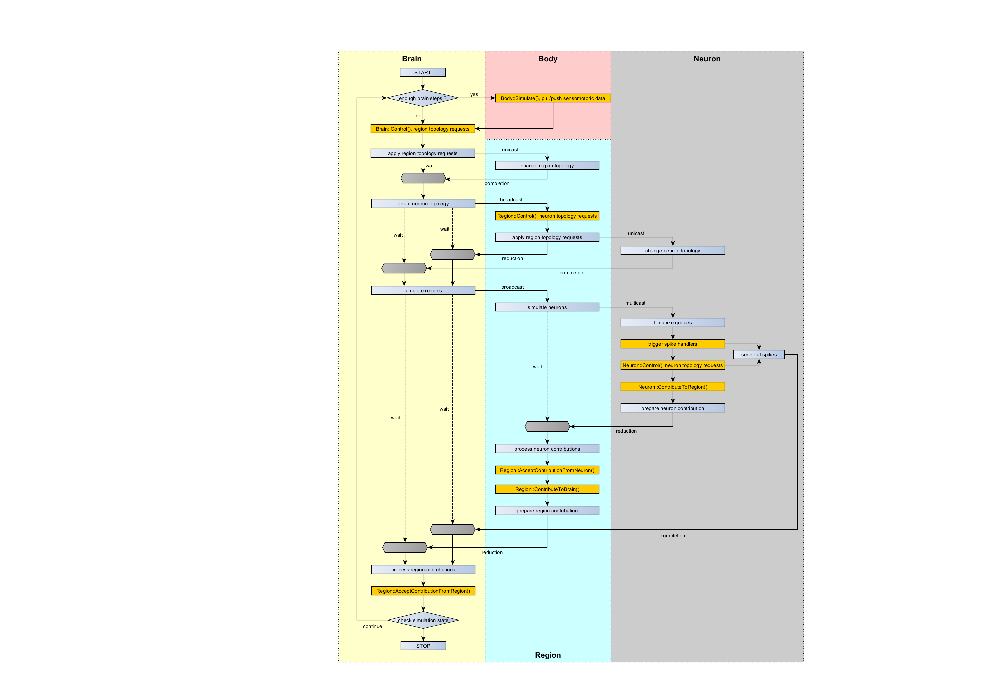

#Arnold Simulator

A scalable actor-model framework for developing AI systems with dynamic topologies.

##Overview

Looking at the diagram should help to quickly establish the overall concept. Simulated objects are placed in a hierarchy - there is a single instance of `Brain`, which manages multiple instances of `Region`, each of which manages multiple instances of `Neuron`, connected with `Synapse` instances through which they are sending `Spike` instances. There is also a single instance of `Body`, which represents the interface between the `Brain` and the external world. All these are meant to be used as super-classes for user-defined classes with custom behavior.

##Synapses and Spikes (synapse.h, spike.h)

A `Synapse` between two neurons is represented by a pair of values on each end. The pair consists of the other end's neuron ID and the associated `Synapse::Data`, which stores the type (`Synapse::GetType`) but otherwise is given meaning by the user-defined code via inheriting from `Synapse::Editor`. By default, the internal structure of the entire pair is flat and carefully aligned to avoid wasting of any bits in padding. 

Content of `Synapse::Data` is duplicated on both ends and automatically synchronized in between time steps, which allows fast bidirectional local access for cross-machine synapses. It is therefore assumed that `Synapse::Data` is not going to be edited on both ends in a single time step. Default capacity of `Synapse::Data` is limited to just a few bytes, which should cover the usual cases efficiently, however it is possible to extend it by allocating separate extra flat block of memory (`Synapse::Editor::AllocateExtra`). 

`Spike` is implemented in a very similar way as `Synapse`. Apart from the type (`Spike::GetType`), it additionally stores the sender neuron's ID in `Spike::Data` (`Spike::GetSender`). Also, to provide a flexible way for the neurons to react on various types of spikes, `Spike::Editor` implements the visitor pattern (see `Spike::Editor::Accept` and `Neuron:HandleSpike`).

The usual way how to create and interact with instances of Synapse or Spike is to first initialize the instance of a particular synapse/spike type (`Synapse::Initialize`, `Spike::Initialize`) and then get the corresponding editor (`Synapse::Edit`, `Spike::Edit`) for further manipulation.

##Neurons, Regions and Connectors (neuron.h, region.h)

Neurons have horizontal and vertical connectivity. Horizontal connectivity is implemented via synapses described in the previous paragraph, vertical connectivity are just plain references to other neurons in the parent-child relationship. Connectivity is stored in special light-weight hashtables (`google::sparsehash`), that have only a few bits overhead per item. Note that although there is a notion of input/output connections, all the connections are in fact bi-directional and support loopback (output of the neuron connected to its own input). Neuron also has a queue of received spikes which are consumed one by one every time step via a visitor pattern mentioned earlier.

Neurons are owned by a Region, which is mainly responsible for their creation/destruction and for scheduling them for execution if they had been triggered (either manually or by receiving a spike). Regions are connected via Connectors (`Connector` class), which are specified by a unique name and neuron count. While synapses between neurons are one-to-one connections (i.e. neuron needs three synapses to connect to other three neurons), connectors are many-to-many connections between regions (i.e. region can use single connector to connect to many other regions, provided that the connectors are of the same size). Internally, connector is just a collection of neurons, so the connectivity is actually also implemented in terms of one-to-one synapses (i.e. if an output connector of size of two neurons is connected to three other connectors of the same size, its internal neurons will each have three output synapses). Connectors can contain neurons of arbitrary type connected via synapses of arbitrary type. With some programming effort to ensure the mutual compatibility, there can be in principle even multiple types of neurons within single connector connected via various different types of synapses.

Both Neurons and Regions have similar object-oriented structure. There is a base class (`NeuronBase`, `RegionBase`) containing most of the common machinery to inspect or modify connectivity, and to send spikes or trigger neurons. Base class contains an instance of abstract class (`Neuron`, `Region`), which if inherited and implemented can contain user-defined code to express the behaviour of a particular neural model (see the Simulation loop section below). User-defined code can access the base class via a reference (`Neuron::mBase`, `Region::mBase`).

##Brain and Body (brain.h, body.h)

Brain is the top-level object of the hierarchy. It manages all the regions and executes the main simulation loop (see below). Body is an object encapsulating the interaction with an external world, whatever that is (e.g. training dataset of pictures loaded from a filesystem, socket connection to some 2D/3D simulation or game, or a driver for a camera and some robotic limbs). The only responsibility of the Body with respect to Brain is to push new sensoric data and pull last motoric data inside of the Body::Simulate method, which is called every few time steps. Brain then acts as a translator between Body and Regions, i.e. transforming plain byte arrays of sensors/actuators to a collection of spikes sent to the neurons within connectors and vice versa. For this to work, Brain implements a Region-like interface with fake connectors, so that Regions don't have to distinguish whether they are connected to Brain or other Regions. Brain also provides the same way how to inject user-defined code as Neuron and Region do.

##Blueprint

To better understand how blueprint is supposed to work, first look at the high-level diagram of an example blueprint and its [json source](Blueprints/random_blueprint.json). It basically defines a simple brain with two eyes, two limbs and two hemispheres connected via a brain stem. The blueprint JSON is gradually parsed and interpreted in constructors of Body, BrainBase, Brain, RegionBase, Region, NeuronBase and Neuron. It is not settled down which parts should be parsed where, i.e. which are common enough for all neural models to be in the *Base constructors, and which are special for just some neural models and therefore should go to user-defined constructors. The example blueprint and the corresponding parsing routines in the Threshold model (see below), shall therefore be understood only as an example. It is also assumed that various neural models will use their own special tags in the blueprint JSON, which will be comprehensible just to their own user-defined constructors. Notice in the example, that the Threshold model blueprint defines sub-region neural structure in a procedural way via use of neuron clusters (bundle of neurons randomly connected via a limited number of synapses) and synaptic webs (bundle of synapses randomly placed between neurons of two neuron clusters). In this manner, connectors are also interpreted as neuron clusters (with no internal synapses within the cluster), so it is possible in the blueprint to express connectivity between declared connectors and procedurally generated neuron clusters.

##Simulation loop 

First, carefully study the simulation loop diagram. It is slightly simplified in certain aspects with respect to the actual implementation but gives a good high-level idea of how the responsibility is divided among the objects, where the flow of control forks and joins, and where user-defined code gets executed (orange boxes). In the actual implementation, this is the execution order of user-defined methods: `Brain::Control`, `Body::Simulate`, `Region::Control`, `Neuron::Control`, `Neuron::ContributeToRegion`, `Neuron::CalculateObserver`, `Region::AcceptContributionFromNeuron`, `Region::ContributeToBrain`, `Brain::AcceptContributionFromRegion`.

#Code organization
Our build chain requires all the source code and headers to be located flat in the core folder. For organization of various models in the solution, use filters. Your own models should implement at least a `Brain` class, which will spawn regions and neurons during initialization.

The various components of models need to be registered in the core. Neurons, Regions and Brains have to be registered inside the `NeuronFactory`, `RegionFactory` and `BrainFactory`, while SynapseEditors and SpikeEditors belong to the `SynapseEditorCache` and `SpikeEditorCache`. This registration is done in Core\init.cpp, ideally through an initialization function which is separate for each model. There is currently no mechanism for automatic discovery/registration.

#Example models

##Threshold model (threshold_\*.cpp)

A random spiking neural network, which should stress test various features and aspects of the simulation infrastructure. Shall also serve as a reference implementation of how to use the infrastructure. Of a particular interest to a reader should be the example usage of a `FunctionalSpike` to establish a communication protocol between Neurons to negotiate an average spiking threshold. Note decisions made in the `ContributeTo*`, `AcceptContributionFrom*` and `Control` methods with regard to when to grow or shrink the entire network.

##Generalist/Specialist model (gen_spec\*.cpp)

A simple growing neural algorithm created for the purpose of testing the growing mechanisms and observation of the system, which might be used as a basis for a [MNIST](http://yann.lecun.com/exdb/mnist/ "MNIST") classifier. To run this model, you have to put the MNIST data files in the folder where core is compiled. The *training* label/image files will work out of the box if you use the blueprint in mnist-genspec.json, otherwise you have to change the relevant values in the blueprint to point to the files.

#UI

The UI client (MS Windows only) is used for blueprint setup, core instance control and model visualization/observation. See the [introduction video](https://www.youtube.com/watch?v=02MiOANARIM "introduction video").

#License

Arnold Simulator source code is licensed under Apache [License](LICENSE), version 2.0; however, it depends on the Charm++ library which has more restrictive license than Arnold Simulator itself. You are allowed to use Charm++ for research and for internal business purposes for free, but you need a special agreement with Charm++ authors for commercial distribution and use. See [Charm++/Converse license](http://charm.cs.illinois.edu/distrib/LICENSE) for details.